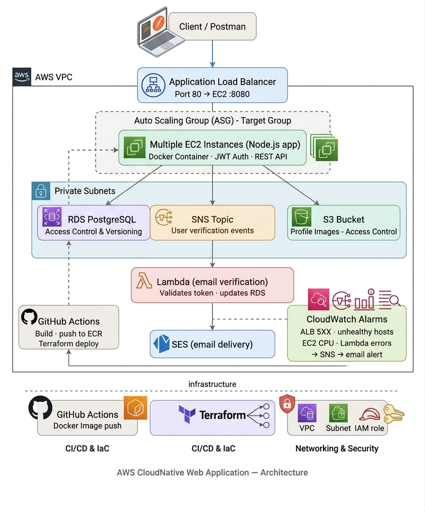

# AWS Cloud-Native Web Application

A production-style cloud-native web application built on AWS using Infrastructure as Code (Terraform), containerization, CI/CD pipelines, and event-driven serverless architecture.

---

## Overview

This project demonstrates the design and implementation of a scalable, secure, and observable cloud-native application using AWS services.

The application supports:
- User authentication with JWT
- Email verification using serverless workflows
- File uploads to S3
- Monitoring and alerting using CloudWatch

---

## Architecture

> Architecture diagram showing the full AWS infrastructure



The application follows a multi-tier architecture deployed within a VPC:

- **Client → Application Load Balancer → EC2 Auto Scaling Group**
- Backend services interact with:
  - RDS PostgreSQL (persistent storage)
  - S3 (file storage)
  - SNS + Lambda + SES (email verification)
- Observability via CloudWatch alarms + SNS alerts
- CI/CD via GitHub Actions + Terraform

---

## Tech Stack

### AWS Services
| Service | Purpose |
|---|---|
| EC2 (Auto Scaling Group) | Scalable compute |
| Application Load Balancer | Traffic distribution |
| RDS (PostgreSQL) | Relational database |
| S3 | Object/file storage |
| SNS | Event messaging |
| Lambda | Serverless processing |
| SES | Email delivery |
| CloudWatch | Monitoring & alerting |
| IAM | Roles & permissions |
| VPC | Networking & isolation |

### DevOps & Tools
- **Terraform** — Infrastructure as Code
- **GitHub Actions** — CI/CD pipelines
- **Docker** — Containerization
- **ECR** — Container Registry

### Backend
- **Node.js** + **Express.js**
- **JWT Authentication**

---

## Application Flow

### Request Flow
```
Client → ALB (Port 80) → EC2 Auto Scaling Group (:8080)
                              ↓
              RDS PostgreSQL / S3 Bucket
```

### Email Verification Flow
```
User signs up
    → App publishes event to SNS
    → Lambda consumes the event
    → Lambda sends email via SES
    → User clicks link → Lambda validates token → updates RDS
```

---

## Monitoring & Alerts

CloudWatch tracks:
- ALB 5XX errors
- EC2 CPU utilization
- Lambda errors and duration
- Unhealthy host count

Alerts are routed via **SNS → Email notifications**.

---

## CI/CD Flow

```
Code pushed to GitHub
    → GitHub Actions builds Docker image
    → Image pushed to ECR
    → Terraform provisions/updates infrastructure
    → EC2 instances pull latest image on boot
```

---

## Infrastructure (Terraform)

Infrastructure is fully managed using Terraform:
- VPC with public and private subnets
- Security groups
- EC2 Auto Scaling Group + Launch Template
- RDS PostgreSQL instance
- S3 bucket with IAM policies
- IAM roles (EC2, Lambda)
- CloudWatch alarms
- SNS topics and subscriptions
- Lambda function + SES integration

---

## Security

- No hardcoded AWS credentials (IAM roles used)
- Sensitive files excluded via `.gitignore`
- Environment variables for JWT secret and database credentials
- S3 access controlled via IAM policies
- VPC private subnets isolate backend services

---

## Getting Started

### Prerequisites
- AWS Account
- Terraform installed (`>= 1.0`)
- Docker installed
- GitHub account (for CI/CD)

### Deployment Steps

```bash
# Clone repository
git clone https://github.com/webapp-cloud-native/tf-aws-infra

# Navigate to Terraform directory
cd terraform/environments/dev

# Initialize Terraform
terraform init

# Preview changes
terraform plan

# Apply infrastructure
terraform apply
```

---

## Repositories

| Repo | Description |
|---|---|
| [webapp](https://github.com/webapp-cloud-native/webapp) | Node.js backend application |
| [serverless](https://github.com/webapp-cloud-native/serverless) | Lambda email verification function |
| [tf-aws-infra](https://github.com/webapp-cloud-native/tf-aws-infra) | Terraform infrastructure code |

---

## Features

- Scalable backend using EC2 Auto Scaling
- Containerized application (Docker + ECR)
- Secure authentication (JWT)
- Event-driven email verification (SNS + Lambda + SES)
- File storage using S3
- Monitoring and alerting via CloudWatch
- Automated CI/CD pipeline
- Infrastructure as Code (Terraform)
